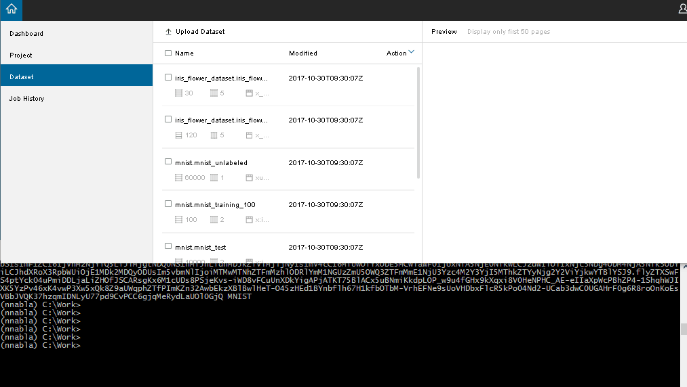
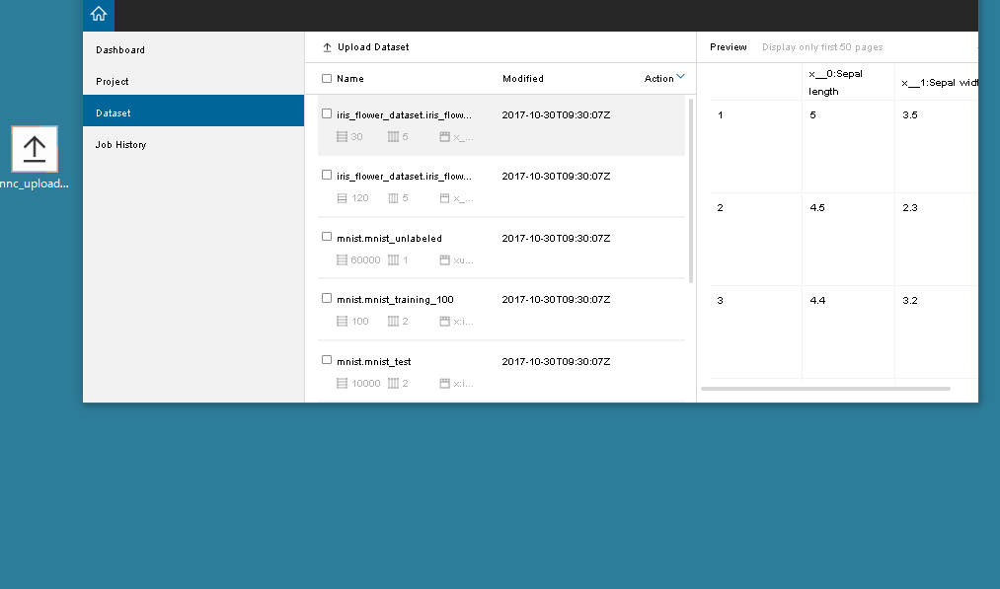

# Dataset uploader

## Prerequisite

```
# pip install boto3 requests tqdm
```

## CUI

### Uploader

Upload CSV dataset.

```
usage: uploader.py [-h] [-e ENV] token filename

positional arguments:
  token              token for upload
  filename           filename to upload

optional arguments:
  -h, --help                        show this help message and exit
  -e ENDPOINT, --endpoint ENDPOINT  set specific endpoint
```

You can use system environment `NNC_ENDPOINT` to change endpoint URI.



## GUI

Upload CSV or TAR.

You can use system environment `NNC_ENDPOINT` to change endpoint URI.


